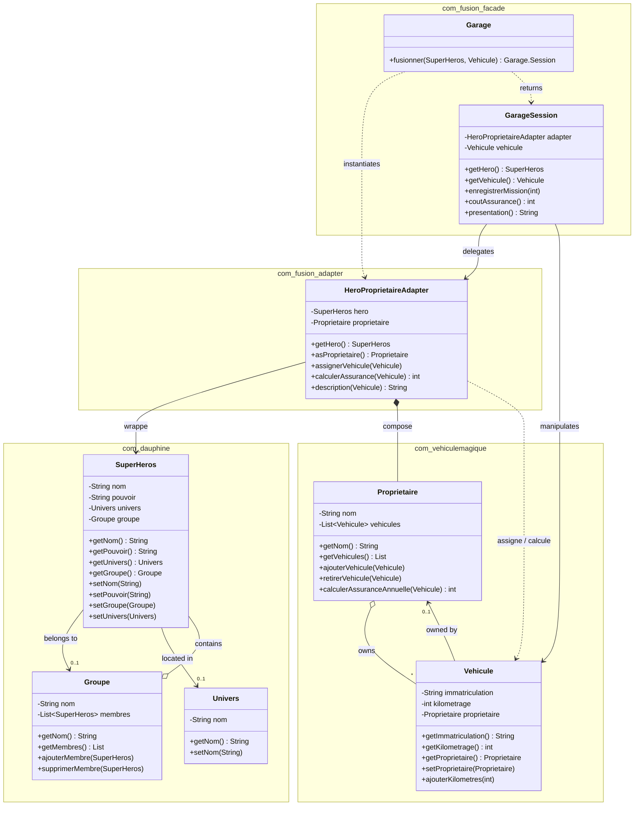

# Fusion Véhicule Magique x Super Héros 🚀

Ce dépôt assemble deux univers initialement indépendants :

1. **vehicule-magique** – un projet BlueJ devenu Maven qui modélise des véhicules, leurs propriétaires et tout un arsenal de tests (unitaires, paramétrés, BDD).
2. **superheros** – une aventure pédagogique narrée par Peter Parker lui‑même, qui introduit la POO, les tests JUnit, les associations bidirectionnelles et le pattern Composite.

Nous avons créé un troisième module, **fusion-module**, qui applique les design patterns *Adapter* et *Facade* pour orchestrer ces deux domaines sans toucher à leur code historique.

---

## 📦 Architecture des modules

```
fusion-vehicule-superheros/
├── pom.xml (parent)
├── vehicule-magique/        # jar com.vehiculemagique:vehicule-magique
├── superheros/              # pom agrégateur + module superhero
│   └── superhero/           # jar com.dauphine:superhero
└── fusion-module/           # jar com.fusion:fusion-module (facade + adapter)
```

Chaque sous-module reste compilable/tests indépendants, le parent lance la totalité via `mvn test`.

---

## 🧩 Diagramme de classe



---

## ✨ Fonctionnalités clés reprises des deux projets

### Vehicule Magique
- Classes `Vehicule` et `Proprietaire` avec **association bidirectionnelle encapsulée** (0..1 ↔ \*), gestion cohérente des affectations.
- Calcul d’assurance (`calculerAssuranceAnnuelle`) basé sur le kilométrage, refactoré (`ajouterKilometres`, `calculerSurcoutKilometrique`).
- Suite de tests riche : unitaires JUnit 5, tests paramétrés (`VehiculeParameterizedTest`), scénarios Cucumber (BDD) autour du suivi kilométrique, de l’assurance et des propriétaires.
- Documentation pédagogique (captures BlueJ, épreuves « Test infected », Loi de Murphy) conservée.

### Super Héros
- Classe `SuperHeros`, `Univers`, `Groupe` avec **association bidirectionnelle** héros/groupe (inspirée d’Avengers/Justice League) et pattern **Composite** (`ICombattant`) pour additionner les puissances.
- Tutoriels narratifs (par Peter Parker) expliquant BlueJ, JUnit, fixtures, tests enregistrés, refactoring et bonnes pratiques.
- Tests JUnit couvrant getters/setters, transfert de groupe, suppression, etc.
- Scénarios Cucumber (BDD) validant identité, univers et gestion des groupes.

---

## 🧱 Nouveau module : fusion-module

| Composant | Description |
|---|---|
| `HeroProprietaireAdapter` | *Adapter* qui expose un `SuperHeros` comme un `Proprietaire`. Il synchronise les informations (nom, véhicules, calcul d’assurance) sans modifier les projets sources. |
| `Garage` | *Facade* fournissant une API simplifiée pour fusionner un héros et un véhicule (création d’une `Garage.Session`, enregistrement de missions, calcul d’assurance, message combiné). |
| `GarageTest` | Test JUnit démontrant la collaboration façade + adapter. |
| `features/Garage.feature` | User stories BDD décrivant l’usage métier de la façade (mission motorisée, scénarios outline multi-héros/kilométrage). |
| `features/adapter.feature` | Stories BDD centrées sur l’adapter pour valider l’enrobage `SuperHeros` → `Proprietaire`. |
| `GarageSteps` / `AdapterSteps` | Implémentations Cucumber (glue `com.fusion.facade.steps`) orchestrant respectivement la façade et l’adapter. |

### Design patterns utilisés
- **Adapter** : `HeroProprietaireAdapter` convertit l’API superhéros vers celle attendue par vehicule-magique.
- **Facade** : `Garage` (et sa `Session`) masquent la complexité et exposent une API orientée cas d’usage.
- **Composite** (hérité du module SuperHeros).

---

## ✅ Tests

Les tests d’origine des deux projets (JUnit + Cucumber) continuent à fonctionner tels quels. Le nouveau module ajoute :

- 1 test JUnit classique (`GarageTest`).
- 2 features Cucumber (`Garage.feature` et `adapter.feature`) couvrant façade et adapter.

Commande globale :

```bash
mvn test
```

Pour limiter aux nouvelles features :

```bash
mvn -pl fusion-module test        # uniquement le module façade
```

---

## 🧪 User stories BDD (fusion-module)

```
Feature: Fusion des univers Super Hero et Vehicule Magique
  Background:
    Given un super héros "Batman" ...
    And un véhicule magique immatriculé "BAT-001"

  Scenario: Déployer un héros sur une mission motorisée
    When j'associe le héros au véhicule via la façade
    And j'enregistre une mission de 200 km
    Then le kilométrage du véhicule vaut 200
    And le coût d'assurance estimé est 300
    And le message fusionné contient "Batman" et "BAT-001"

  Scenario Outline: Réutiliser la façade pour plusieurs héros et missions
    ...
```

Ces scénarios vivent dans `fusion-module/src/test/resources/features/Garage.feature` (façade) et `adapter.feature` (adapter) et utilisent les steps `GarageSteps` et `AdapterSteps`.

---

## 🚀 Quick Start

```bash
# Cloner le repo
git clone <repo>
cd fusion-vehicule-superheros

# Compiler + exécuter tous les tests (vehicule-magique, superhero, fusion-module)
mvn clean test
```

Ensuite, explore les sous-modules :
- `vehicule-magique/` – logique véhicule/propriétaire + BDD
- `superheros/superhero/` – logique super héros + BDD + Composite
- `fusion-module/` – façade, adapter, stories de fusion

---

## 📝 Ressources historiques
- `vehicule-magique/README.md` – récit complet de la genèse véhicule magique, BlueJ, captures, refactoring et tests.
- `superheros/readme.md` – tutoriel complet de Peter Parker sur BlueJ, POO, JUnit et évolution vers des structures avancées.

Ces documents restent inchangés pour conserver la narration originale, tandis que ce README décrit la vision globale et les ajouts de fusion.

---

Bonne fusion ! 🕸️🚗✨
