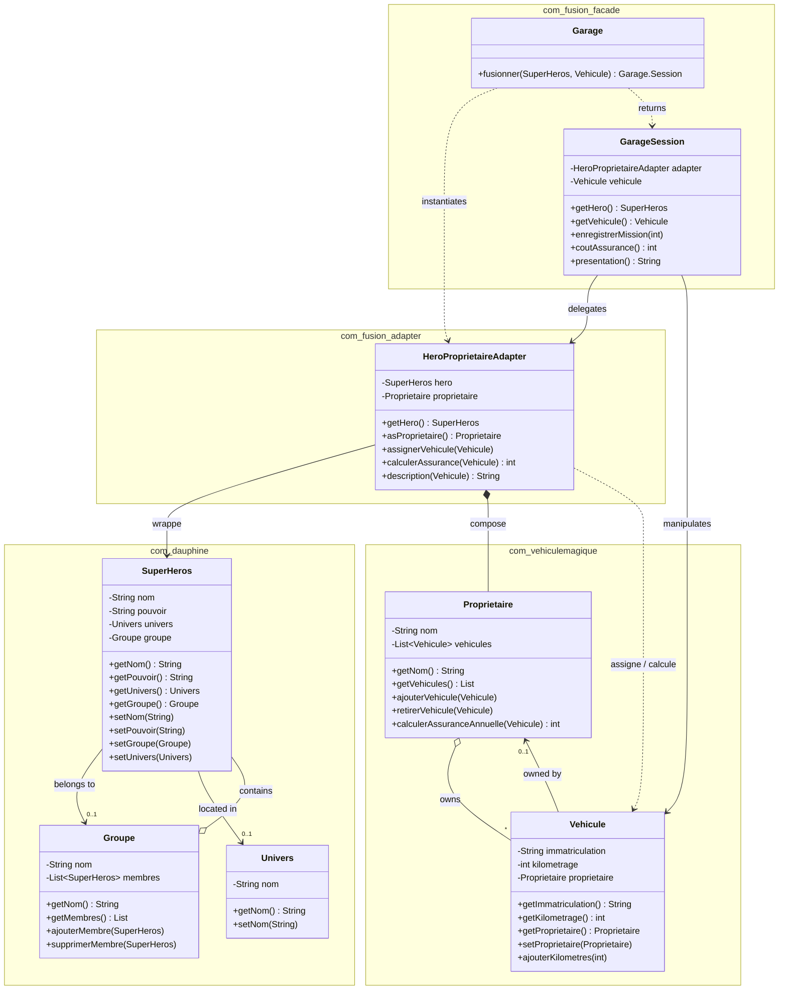

# Class Diagram

This diagram illustrates the structure of the project, including the relationships between the `superheros`, `vehicule-magique`, and `fusion-module` modules.

```mermaid
classDiagram
    %% Relationships
    Garage ..> HeroProprietaireAdapter : instantiates
    Garage ..> GarageSession : returns
    GarageSession --> HeroProprietaireAdapter : delegates
    GarageSession --> Vehicule : manipulates

    HeroProprietaireAdapter --> SuperHeros : wrappe
    HeroProprietaireAdapter *-- Proprietaire : compose
    HeroProprietaireAdapter ..> Vehicule : assigne / calcule

    Groupe o-- "*" SuperHeros : contains
    SuperHeros --> "0..1" Groupe : belongs to
    SuperHeros --> "0..1" Univers : located in

    Proprietaire o-- "*" Vehicule : owns
    Vehicule --> "0..1" Proprietaire : owned by

    %% Packages definition
    namespace com_dauphine {
        class SuperHeros {
            -String nom
            -String pouvoir
            -Univers univers
            -Groupe groupe
            +getNom() String
            +getPouvoir() String
            +getUnivers() Univers
            +getGroupe() Groupe
            +setNom(String)
            +setPouvoir(String)
            +setGroupe(Groupe)
            +setUnivers(Univers)
        }
        class Groupe {
            -String nom
            -List~SuperHeros~ membres
            +getNom() String
            +getMembres() List
            +ajouterMembre(SuperHeros)
            +supprimerMembre(SuperHeros)
        }
        class Univers {
            -String nom
            +getNom() String
            +setNom(String)
        }
    }

    namespace com_vehiculemagique {
        class Vehicule {
            -String immatriculation
            -int kilometrage
            -Proprietaire proprietaire
            +getImmatriculation() String
            +getKilometrage() int
            +getProprietaire() Proprietaire
            +setProprietaire(Proprietaire)
            +ajouterKilometres(int)
        }
        class Proprietaire {
            -String nom
            -List~Vehicule~ vehicules
            +getNom() String
            +getVehicules() List
            +ajouterVehicule(Vehicule)
            +retirerVehicule(Vehicule)
            +calculerAssuranceAnnuelle(Vehicule) int
        }
    }

    namespace com_fusion_adapter {
        class HeroProprietaireAdapter {
            -SuperHeros hero
            -Proprietaire proprietaire
            +getHero() SuperHeros
            +asProprietaire() Proprietaire
            +assignerVehicule(Vehicule)
            +calculerAssurance(Vehicule) int
            +description(Vehicule) String
        }
    }

    namespace com_fusion_facade {
        class Garage {
            +fusionner(SuperHeros, Vehicule) Garage.Session
        }
        class GarageSession {
            -HeroProprietaireAdapter adapter
            -Vehicule vehicule
            +getHero() SuperHeros
            +getVehicule() Vehicule
            +enregistrerMission(int)
            +coutAssurance() int
            +presentation() String
        }
    }
```
