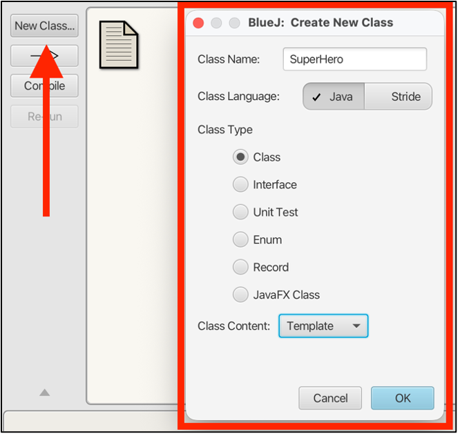
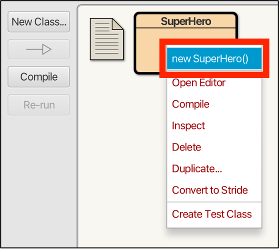
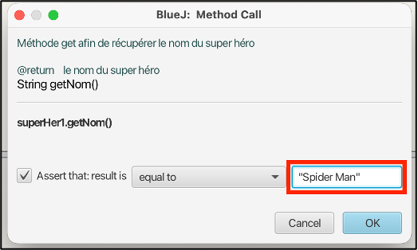

# Tutoriel BlueJ 🕷️

Salut ! 👋

Moi, c’est **Peter Parker**. La journée, je suis étudiant un peu geek, et le reste du temps… bon, disons que je m’y connais en **super-héros** 😅. Aujourd’hui, je vais te guider dans un tutoriel pour apprendre à utiliser **BlueJ**, coder en **Java**, et tester ton code avec **JUnit**. Accroche-toi à ta toile, on commence !

---

## 🧪 Objectif de la mission

Comme quand je bricole un gadget dans ma chambre, on va avancer étape par étape :

* Installer BlueJ
* Créer un projet Java
* Créer une classe **SuperHeros** (forcément 😎)
* Tester notre code avec JUnit

---

## 🕸️ Étape 1 : Télécharger BlueJ

Avant d’enfiler le costume, il faut l’équipement.

Télécharge **BlueJ** sur le site officiel :
👉 [http://www.bluej.org/](http://www.bluej.org/)

Choisis la version adaptée à ton système (Windows, macOS ou Linux), puis installe le logiciel en suivant les instructions.

---

## 🧱 Étape 2 : Créer le projet

Une fois BlueJ lancé :

1. Clique sur **Project** → **New Project**
2. Donne-lui un nom bien héroïque :

```
SuperHerosProject
```

C’est notre QG. 🏢

<p align="center">
  
  
</p>

---

## 🦸 Étape 3 et 4 : Créer la classe SuperHeros

Comme chaque héros a une origine, on va créer la nôtre :

1. Clique sur **New Class**
2. Nomme-la **SuperHeros**
3. Valide avec **OK**

Compile la classe (clic droit → **Compile**). La compilation, c’est comme vérifier que ton lance-toile ne va pas exploser dans ta main.

<p align="center">
  
</p>
<p align="center">
  
</p>

---

## 🧬 Étape 5 : Créer une instance (Spider-Man entre en scène)

Clic droit sur la classe **SuperHeros** → **new SuperHeros()**

Entre le nom :

```
SpiderMan
```

Un carré rouge apparaît en bas : c’est ton objet ! 🟥

👉 La classe, c’est le moule. L’objet, c’est le gâteau. Et ici, on a clairement un gâteau Spider-Man.

<p align="center">
  
</p>

---

## 🧠 Étape 6 : Modifier le code de SuperHeros

Clic droit sur la classe → **Open Editor**.

### 🔧 Ajouter des attributs

Remplace l’attribut existant par :

```java
private String nom;
private String pouvoir;
```

### 🏗️ Modifier le constructeur

Le constructeur doit initialiser le nom et le pouvoir du héros.

### 👀 Créer les getters

Ils permettent de lire les informations du héros :

* `getNom()`

```java
public String getNom()
    {
        return nom;
    }
```
* `getPouvoir()`

```java
public String getPouvoir()
    {
        return pouvoir;
    }
```

### ✍️ Créer les setters

Ils permettent de modifier ces informations :

* `setNom(String nom)`

```java
public void setNom(String nom)
    {
        this.nom = nom;
    }
```
* `setPouvoir(String pouvoir)`

```java
public void setPouvoir(String pouvoir)
    {
        this.pouvoir = pouvoir;
    }
```

Compile à nouveau la classe pour sauvegarder tout ça.

---

## 🧪 Étape 7 : Tester manuellement la classe

Réinstancie la classe **SuperHeros**.

Une fenêtre apparaît : entre un nom et un pouvoir **entre guillemets** (eh oui, ce sont des chaînes de caractères).

Teste ensuite :

* `getNom()` → doit afficher le nom entré
* `setNom()` ou `setPouvoir()` → pour modifier les valeurs

<p align="center">
  
</p>

Si tout fonctionne, ton héros est opérationnel 💪

---

## 🧫 Étape 8 : Créer une classe de test (JUnit)

Même Spider-Man teste son matériel.

1. Crée une nouvelle classe
2. Nom : **SuperHerosTest**
3. Type : **Unit Test**

Un carré vert apparaît 🟩 : c’est la classe de test.


<p align="center">
  
</p>

---

## ⏺️ Étape 9 : Enregistrer un test

Clic droit sur **SuperHerosTest** → **Create Test Method**

<p align="center">
  
</p>

Entre un nom de test. À partir de maintenant, BlueJ enregistre tout ce que tu fais.

* Instancie un objet SuperHeros
* Termine l’enregistrement avec **End**

<p align="center">
  
</p>

Tu peux rejouer ce test à tout moment avec **Test All**.

---

## 🌍 Étape 10 : Ajouter un Univers

Un super-héros n’existe pas sans son monde.

1. Crée une nouvelle classe **Univers** et mets-y le code suivant :

```java
public class Univers
{
    private String nom;

    public Univers(String nom)
    {
        this.nom = nom;
    }

    public String getNom()
    {
        return nom;
    }

    public void setNom(String nom)
    {
        this.nom = nom;
    }
}
```

2. Ajoute un attribut `Univers` dans **SuperHeros**

```java
private Univers univers;
```

3. Crée le getter et le setter associés

```java
public Univers getUnivers()
    {
        return univers;
    }

    public void setUnivers(Univers univers)
    {
        this.univers = univers;
    }
```

Ainsi, ton héros est enfin lié à son univers (Marvel, évidemment 😉).

---

## 🧾 Étape 11 : Méthode toString()

Pour afficher proprement les infos du héros, ajoute la méthode `toString()` dans **SuperHeros**.

Elle permettra d’afficher le nom, le pouvoir et l’univers du héros.

```java
public String toString()
{
    String nomUnivers = (univers == null) ? "Aucun univers" : univers.getNom();
    return "SuperHeros{nom='" + nom + "', pouvoir='" + pouvoir + "', univers='" + nomUnivers + "'}";
}
```

---

## 🧪 Étape 12 : Tests avancés avec JUnit

Avant chaque test, tu peux préparer le terrain :

* Instancier un **SuperHeros**
* Instancier un **Univers**
* Lier les deux avec `setUnivers()`

Ensuite :

* Clic droit sur la classe de test
* **Object Bench to Test Fixture**

<p align="center">
  
</p>

Tout est transformé en code automatiquement 🧙‍♂️

---

## ✅ Étape 13 : Vérifier les résultats

Crée un nouveau test JUnit.

Teste par exemple `getNom()` :

* Résultat attendu :

```
Spider Man
```

Choisis l’opérateur d’égalité et valide.

<p align="center">
  
</p>

Lance tous les tests avec **Test All**. Si tout est vert, mission accomplie 🎉


# 🕷️ Tutoriel BlueJ – Partie 2  
### *(Toujours raconté par Peter Parker)*

Salut ! 👋  
C’est encore moi, **Peter Parker**.

Dans la **première partie** de ce tutoriel, on a posé les bases, tranquillement, comme quand je fabriquais mon premier lance-toile dans ma chambre 🕸️ :

- Installation de **BlueJ**
- Création d’un **projet Java**
- Manipulation des **classes** et des **objets**
- Ajout d’un **univers**
- Premiers **tests JUnit**
- Une méthode `toString()` propre et lisible

Bref, ton super-héros était opérationnel 💪  
Mais… il travaillait encore **en solo**.

---

## 🧩 Pourquoi une Partie 2 ?

Parce qu’aucun super-héros ne progresse seul très longtemps.

Dans cette **Partie 2**, on passe au **niveau supérieur**.  
On va apprendre à faire évoluer notre code comme dans un vrai projet professionnel :

- 🤝 Gérer des **équipes de héros** (associations bidirectionnelles)
- 🧪 Écrire des **tests robustes** qui protègent ton architecture
- 🧹 Nettoyer et améliorer le code avec le **refactoring**
- 🧠 Introduire un **design pattern** (Composite)
- 💻 Utiliser la **ligne de commande** avec Maven
- 💥 Faire face à la réalité… et à la **Loi de Murphy**

Ici, on ne clique plus seulement sur des boutons verts.  
On **pense**, on **structure**, on **anticipe les bugs**.

## 🕸️ Accroche-toi bien…


## 🤝 Étape 14 : L’union fait la force  
### *(Association bidirectionnelle 0..1 ↔ \*)*

Bon, combattre le crime tout seul, c’est stylé… mais à un moment, même moi j’ai eu besoin d’une équipe.  
Les **Avengers**, la **Justice League**, les **X-Men**… aucun grand héros n’avance sans groupe.

En programmation objet, ce genre de relation s’appelle une **association bidirectionnelle** :

- **0..1** : un héros peut n’avoir **aucun groupe** ou **un seul**
- **\*** : un groupe peut contenir **plusieurs héros**

⚠️ Le piège classique :  
Si un héros rejoint un groupe, **les deux doivent être au courant**.  
Sinon… *bug*, incohérence, et ville détruite 💥

---

### 🧱 1. Créer la classe `Groupe`

Crée une nouvelle classe **Groupe** (dans le package `com.dauphine` si tu en utilises un).

```java
package com.dauphine;

import java.util.ArrayList;
import java.util.List;

public class Groupe {
    private String nom;
    private List<SuperHeros> membres;

    public Groupe(String nom) {
        this.nom = nom;
        this.membres = new ArrayList<>();
    }

    public String getNom() {
        return nom;
    }

    public List<SuperHeros> getMembres() {
        return membres;
    }

    public void supprimerMembre(SuperHeros hero) {
        if (this.membres.contains(hero)) {
            this.membres.remove(hero);
            if (hero.getGroupe() == this) {
                hero.setGroupe(null);
            }
        }
    }

    public void ajouterMembre(SuperHeros hero) {
        if (hero != null && !this.membres.contains(hero)) {
            this.membres.add(hero);
            if (hero.getGroupe() != this) {
                hero.setGroupe(this);
            }
        }
    }
}
````

👉 Le groupe **contrôle sa liste** et protège la cohérence.
C’est ça, l’encapsulation.

---

### 🧠 2. Une méthode `setGroupe()` intelligente

Retourne dans **SuperHeros.java** et ajoute :

```java
private Groupe groupe;

public Groupe getGroupe() {
    return this.groupe;
}

public void setGroupe(Groupe nouveauGroupe) {
    if (this.groupe == nouveauGroupe) {
        return;
    }

    Groupe ancienGroupe = this.groupe;
    this.groupe = nouveauGroupe;

    if (ancienGroupe != null) {
        ancienGroupe.supprimerMembre(this);
    }

    if (nouveauGroupe != null) {
        nouveauGroupe.ajouterMembre(this);
    }
}
```

🕸️ Résultat :
Impossible d’avoir un héros **dans deux groupes** ou **dans aucun sans le savoir**.

---

### 🧪 3. Tester la robustesse (JUnit)

Ajoute ce test dans **SuperHerosTest.java** :

```java
@Test
public void testTransfertHeros() {
    Groupe avengers = new Groupe("Avengers");
    Groupe justiceLeague = new Groupe("Justice League");

    spiderman.setGroupe(avengers);

    assertTrue(avengers.getMembres().contains(spiderman));
    assertEquals(avengers, spiderman.getGroupe());

    spiderman.setGroupe(justiceLeague);

    assertEquals(justiceLeague, spiderman.getGroupe());
    assertTrue(justiceLeague.getMembres().contains(spiderman));
    assertFalse(avengers.getMembres().contains(spiderman),
        "Spidey ne doit plus être un Avenger");
}
```

✅ Si tout est vert, ton association est **solide comme ma toile**.

---

## 🧹 Étape 15 : Le grand nettoyage

### *(Refactoring)*

Coder, ce n’est pas seulement faire fonctionner.
C’est aussi **rendre le code lisible, maintenable et élégant**.

---

### 🏷️ Technique 1 : Rename

Une variable appelée `superHer1`, c’est… criminel 😅

**Mission :**

1. Clic droit sur la variable
2. *Rename Symbol* (ou `F2`)
3. Renomme-la en `spiderman`

✨ Tout le code est mis à jour automatiquement.

---

### Technique 2 : Extract Method (Extraire la méthode) 📦

**La situation :** Ta méthode de test `testTransfertHeros` est devenue une jungle de `assertTrue`, `assertEquals`, `assertFalse`... C'est difficile de comprendre le scénario au milieu de tout ce code technique.

**La mission :** On va extraire la logique de vérification pour que le test se lise comme un script de comics.

**Comment faire :**
1.  Sélectionne les lignes de `assert` qui vérifient qu'un héros est dans un groupe.
2.  Utilise l'ampoule jaune (💡) ou `Ctrl` + `.` -> **Extract Method**.
3.  Nomme-la `verifierHerosEstBienDansLeGroupe`.
4.  Fais pareil pour la vérification de départ !

**Le résultat :** Regarde comme ton test devient limpide 👇

```java
    @Test
    public void testTransfertHeros() {
        Groupe avengers = new Groupe("Avengers");
        Groupe justiceLeague = new Groupe("Justice League");
        
        spiderman.setGroupe(avengers);
        verifierHerosEstBienDansLeGroupe(spiderman, avengers);

        spiderman.setGroupe(justiceLeague);

        verifierHerosEstBienDansLeGroupe(spiderman, justiceLeague);
        verifierHerosNestPlusDansLeGroupe(spiderman, avengers);
    }


    private void verifierHerosEstBienDansLeGroupe(SuperHeros h, Groupe g) {
        assertEquals(g, h.getGroupe(), "Le héros " + h.getNom() + " devrait pointer vers le groupe " + g.getNom());
        assertTrue(g.getMembres().contains(h), "Le groupe " + g.getNom() + " devrait contenir " + h.getNom());
    }

    private void verifierHerosNestPlusDansLeGroupe(SuperHeros h, Groupe g) {
        assertFalse(g.getMembres().contains(h), "Le groupe " + g.getNom() + " ne devrait plus contenir " + h.getNom());
        if (h.getGroupe() == g) {
            fail("Le héros " + h.getNom() + " pointe toujours vers l'ancien groupe " + g.getNom());
        }
    }
```


---

## 🧠 Étape 16 : Mode “Test Infected”

### *(Pattern Composite)*

Un méchant comme Thanos se fiche de savoir s’il affronte :

* un héros seul
* ou une équipe entière

Il veut juste connaître la **puissance totale**.

---

### 🧩 Mise en place du Pattern Composite

1. Crée une interface :

```java
public interface ICombattant {
    int getPuissanceTotale();
}
```

2. **SuperHeros** implémente l’interface
3. **Groupe** implémente l’interface et additionne les forces

👉 Résultat :
Un héros ou un groupe se manipulent **de la même manière**.

```java
ICombattant ennemi = avengers;
ennemi.getPuissanceTotale();
```

💥 Design propre. Architecture élégante. Tests heureux.

---

## 💻 Étape 17 : Hacker le système

### *(Ligne de commande)*

Les vrais héros utilisent le terminal 😎

1. Ouvre le terminal intégré
2. Place-toi à la racine du projet
3. Lance :

```bash
mvn test
```

* ✅ **BUILD SUCCESS** : tout est sous contrôle
* ❌ **BUILD FAILURE** : bienvenue dans le vrai métier

---

## 💥 Étape 18 : La Loi de Murphy

> *« Tout ce qui peut mal tourner, tournera mal. »*

Et en informatique :

> *« Rien n’est aussi simple qu’il n’y paraît. »*

Migration BlueJ → VS Code :

* dossiers incorrects
* conflit JUnit 4 / JUnit 5
* problèmes GitHub

🎯 **Leçon finale** :
Un bon développeur ne fuit pas la complexité.
Il la **comprend**, la **teste**, et la **dompte**.

---

## 🕷️ Conclusion

Tu as maintenant :

* un code **orienté objet solide**
* des **tests fiables**
* une **architecture propre**
* et une vraie **posture de développeur**

Comme toujours :

> *« Un grand pouvoir implique de grandes responsabilités… surtout quand on code. »*